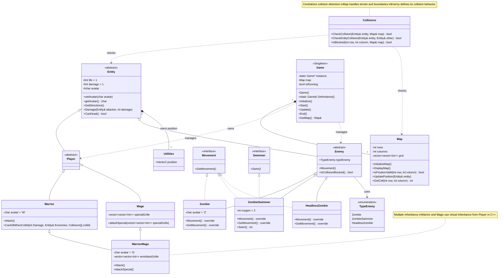

# Game Architecture – UML Class Diagram

## Complete UML Diagram

```mermaid
classDiagram
direction TB

%% =========================
%% ENTITY
%% =========================

class Entity {
    <<abstract>>
    #int life = 1
    #int damage = 1
    #char avatar
    +setAvatar(char avatar)
    +getAvatar() char
    +GetDirections()
    +Damage(Entity& attacker, int damage)
    +CanDead() bool
}

%% =========================
%% PLAYER
%% =========================

class Player {
    <<abstract>>
}

class Warrior {
    -char avatar = 'W'
    +Attack()
    +CanKillWhenCollid(int Damage, Entity& Ennemies, Collisions[] collid)
}

class Mage {
    -vector~vector~int~~ specialGrille
    +attackSpecial(vector~vector~int~~ specialGrille)
}

class WarriorMage {
    -char avatar = 'G'
    -vector~vector~int~~ wmAttackGrille
    +Attack()
    +attackSpecial()
}

%% =========================
%% ENEMY
%% =========================

class Enemy {
    <<abstract>>
    +TypeEnemy typeEnemy
    +Movement()
    +IsCollisionBlocked() bool
}

class Zombie {
    -char avatar = 'Z'
    +Movement() override
    +GetMovement() override
}

class ZombieSwimmer {
    -int oxygen = 3
    +Movement() override
    +GetMovement() override
    +Swim() int
}

class HeadlessZombie {
    +Movement() override
    +GetMovement() override
}

%% =========================
%% ENUM
%% =========================

class TypeEnemy {
    <<enumeration>>
    Zombie
    ZombieSwimmer
    HeadlessZombie
}

%% =========================
%% INTERFACES
%% =========================

class Movement {
    <<interface>>
    +GetMovement()*
}

class Swimmer {
    <<interface>>
    +Swim()*
}

%% =========================
%% UTILITIES
%% =========================

class Utilities {
    +Vector2 position
}

%% =========================
%% COLLISIONS
%% =========================

class Collisions {
    +CheckCollision(Entity& entity, Map& map) bool
    +CheckEntityCollision(Entity& entity, Entity& other) bool
    +IsBlocked(int row, int column, Map& map) bool
}

%% =========================
%% MAP
%% =========================

class Map {
    -int rows
    -int columns
    -vector~vector~int~~ grid
    +InitializeMap()
    +DisplayMap()
    +IsPositionValid(int row, int column) bool
    +UpdatePosition(Entity& entity)
    +GetCell(int row, int column) int
}

%% =========================
%% GAME SINGLETON
%% =========================

class Game {
    <<Singleton>>
    -static Game* instance
    -Map map
    -bool isRunning
    -Game()
    +static Game& GetInstance()
    +Initialize()
    +Start()
    +Update()
    +End()
    +GetMap() Map&
}

%% =========================
%% INHERITANCE
%% =========================

Entity <|-- Player
Player <|-- Warrior
Player <|-- Mage

Warrior <|-- WarriorMage
Mage <|-- WarriorMage

Entity <|-- Enemy
Enemy <|-- Zombie
Enemy <|-- ZombieSwimmer
Enemy <|-- HeadlessZombie

%% =========================
%% INTERFACE IMPLEMENTATION
%% =========================

Movement <|.. Zombie
Movement <|.. ZombieSwimmer
Movement <|.. HeadlessZombie

Swimmer <|.. ZombieSwimmer

%% =========================
%% ASSOCIATIONS
%% =========================

Entity "1" *-- "1" Utilities : owns position

Enemy --> TypeEnemy : uses

Game "1" *-- "1" Map : owns

Game ..> Player : manages
Game ..> Enemy : manages

Collisions ..> Entity : checks
Collisions ..> Map : checks

note for WarriorMage "Multiple inheritance.\nWarrior and Mage use virtual inheritance from Player in C++."

note for Collisions "Centralizes collision detection.\nMap handles terrain and boundaries.\nEnemy defines its collision behavior."
```
